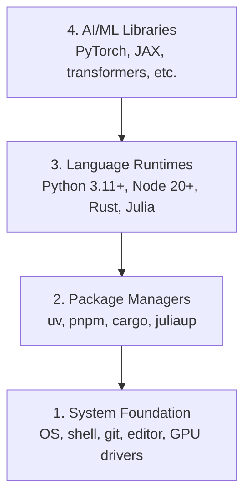

# بيئة التنمية

> أدواتك تشكل تفكيرك، قم بتنظيمها مرة واحدة، قم بتنظيمها بشكل صحيح.

**Type:** Build
**Languages:** Python, Node.js, Rust
**Prerequisites:** None
**Time:** ~45 minutes

## أهداف التعلم

- قم بتعيين Python 3.11+، Node.js 20+، و Rust من الصفر
- تكوين بيئات افتراضية ومديري الحزم للمبنيات المتكملة
- التحقق من وصول GPU مع CUDA / MPS وإجراء عملية اختبار التنسور
- فهم كومة أربع طبقات: النظام، الحزم، أوقات تشغيل، مكتبات الذكاء الاصطناعي

## المشكلة

أنت على وشك تعلم هندسة الذكاء الاصطناعي عبر 500 دروس تستخدم بايثون، الكتابة النمطية، الخرق، وجوليا. إذا تم تدمير بيئتك، كل دروس واحد يصبح معركة ضد الأدوات بدلا من التعلم.

معظم الناس يخطون إعداد البيئة ثم يقضون ساعات في تحليل أخطاء الاستيراد، نزاعات الإصدارات، ووقودات CUDA المفقودة. سنقوم بهذا مرة واحدة، بشكل صحيح.

## المفهوم

بيئة هندسة الذكاء الاصطناعي لديها أربع طبقات:



نضع من أسفل إلى أعلى كل طبقة تعتمد على الطبقة التي تحتها

```figure
s0-env-stack
```

## بناءها

### الخطوة الأولى: أساس النظام

تحقق من نظامك ووضع الأساسيات

```bash
# macOS
xcode-select --install
brew install git curl wget

# Ubuntu/Debian
sudo apt update && sudo apt install -y build-essential git curl wget

# Windows (use WSL2)
wsl --install -d Ubuntu-24.04
```
wsl --install -d Ubuntu-24.04 هذا قد يعطي خطأ كما النسخة المحددة المذكورة هي المشكلة ببساطة وضعت 
wsl --install --d Ubuntu

### الخطوة الثانية: Python مع UV

نحن نستخدم`uv` هو 10-100x أسرع من البوابة ويعالج البيئات الافتراضية تلقائيا.

```bash
curl -LsSf https://astral.sh/uv/install.sh | sh      #if using windows remember to use bash instead of powershell
# globally install from https://www.python.org/downloads/windows/

uv python install 3.12

#to install pyhton globally in powershell using windpws package manager winget install -e --id Python.Python.3.12

uv venv
source .venv/bin/activate  # or .venv\Scripts\activate on Windows
#I used  source .venv/Scripts/activate  to activate the virtual environment in bash in windows 

uv pip install numpy matplotlib jupyter
```

التحقق من:

للتحقق من أن Python قد تم تثبيته بالفعل باستخدام مدير حزم uv ببساطة كتابة Python في bash فسوف تفتح Python مترجم

```python
import sys
print(f"Python {sys.version}")

import numpy as np
print(f"NumPy {np.__version__}")
a = np.array([1, 2, 3])
print(f"Vector: {a}, dot product with itself: {np.dot(a, a)}")
```

### الخطوة 3: Node.js مع pnpm

للدرسات TypScript (وكلاء، خادمات MCP، تطبيقات الويب).

```bash 
fnm stands for Fast Node Manager. It's a Node.js version manager written in Rust that lets you:

What it does:

Install and switch between multiple versions of Node.js
Manage Node.js versions per project or globally
Automatically use the right Node.js version for each project

```

```bash
You can't install fnm with uv because fnm is a Node.js version manager (not a Python package), while uv is for Python package

```

```bash
curl -fsSL https://fnm.vercel.app/install | bash
# for me above command curl didn't worked use in powershell winget install Schniz.fnm
# restart the terminal or open a new terminal cmd  whatever
fnm install 22
fnm use 22

npm install -g pnpm

node -e "console.log('Node', process.version)"
```

كما قمت بتثبيتها باستخدام winget تنسيق schniz.fnm 
```bash

Start with step 3 if this command does not work notepad $PROFILE then follow 
No problem — your PowerShell profile folder/file doesn't exist yet. Let's create it.

Run these one by one in PowerShell:

Step 1
 New-Item -ItemType Directory -Force -Path (Split-Path $PROFILE)


Then:
Step 2 
New-Item -ItemType File -Force -Path $PROFILE


Now open it:
Step 3
notepad $PROFILE


Paste this line into Notepad:
Step 4
fnm env --use-on-cd | Out-String | Invoke-Expression


Save and close Notepad.

Then close the PowerShell/VS Code terminal and open a new one.

Test:

Step 5
fnm --version


Then:

fnm install 22

// below command was not working  current PowerShell session still isn't loading the FNM environment.

Troubleshoot
Perfect 👍 FNM is working now.

That warning just means Node.js 22.23.2 is already installed, so you don't need to install it again.

Run:

fnm use 22


Then:

node -v


You should see:

v22.23.2


And check npm:

npm -v

If fnm use 22 works

You're all set. 🎉

For your AI Engineering From Scratch project, you can now run:

npm init -y


or, if you're starting a project with a framework, we can set that up next.

still if fnm use 22 doesn't work then

Got it — FNM itself is installed, but your current PowerShell session still isn't loading the FNM environment.

Let's fix it directly.

1. Check your profile path

Run:

echo $PROFILE


It should show something like:

C:\Users\deepa\Documents\WindowsPowerShell\Microsoft.PowerShell_profile.ps1

2. Add FNM to the profile automatically

Run this exact command:

"fnm env --use-on-cd | Out-String | Invoke-Expression" | Add-Content -Path $PROFILE

3. Load the profile immediately

Instead of restarting, run:

. $PROFILE


Then check:

fnm env


You should see several environment-variable commands.

4. Now use Node 22
fnm use 22


Then:

node -v


Expected:

v22.23.2

If you still get the same error

Run these two commands and send me the output:

echo $PROFILE


and

Get-Content $PROFILE


I'll tell you exactly what needs to be changed.
fnm use 22
node -v


You should get a Node version beginning with v22.


still use not working was getting 3 lines

Great — your profile is correct and FNM is configured. You just have the same line 3 times, which isn't necessary.

Let's clean it up and make sure it loads correctly.

1. Replace your profile with one FNM line

Run:

Set-Content $PROFILE 'fnm env --use-on-cd | Out-String | Invoke-Expression'


Now verify:

Get-Content $PROFILE


You should see only one line:

fnm env --use-on-cd | Out-String | Invoke-Expression

2. Reload the profile

Run:

. $PROFILE

3. Check FNM

Run:

fnm --version


You should get:

1.39.0

4. Use Node 22

Now run:

fnm use 22


Then:

node -v


You should get:

v22.23.2

If it STILL gives the environment-variable error

Run:

fnm env


and send me the output. Don't reinstall Node or FNM yet — your installation appears fine; we're just fixing the PowerShell environment.

then if this is the error shown in powershell


PS C:\Users\deepa\OneDrive\Desktop\AI Engineering From Scratch> . $PROFILE
. : File C:\Users\deepa\OneDrive\Documents\WindowsPowerShell\Microsoft.PowerShell_profile.ps1 cannot be loaded because
running scripts is disabled on this system. For more information, see about_Execution_Policies at
https:/go.microsoft.com/fwlink/?LinkID=135170.
At line:1 char:3
+ . $PROFILE
+   ~~~~~~~~
    + CategoryInfo          : SecurityError: (:) [], PSSecurityException
    + FullyQualifiedErrorId : UnauthorizedAccess

then

Aha — now we found the actual problem. 👍

FNM is installed correctly. Your PowerShell execution policy is blocking your profile script from running.

Let's fix that.

1. Allow your PowerShell profile to run

Run this in PowerShell:

Set-ExecutionPolicy -ExecutionPolicy RemoteSigned -Scope CurrentUser


If PowerShell asks:

Execution Policy Change
[Y] Yes  [A] Yes to All  [N] No ...


Type:

Y


and press Enter.

2. Load your profile

Now run:

. $PROFILE


There should be no error.

3. Use Node 22
fnm use 22


Then:

node -v


You should get:

v22.23.2


And:

npm -v

4. Verify everything

You can run:

fnm current
node -v
npm -v


If node -v shows v22.23.2, you're completely set. 🚀

Don't reinstall FNM or Node. The issue was simply PowerShell's script execution policy.


```


**macOS / Apple Silicon (M1/M2/M3/M4):**إذا توقف التركيب عن`Error: Cannot install under Rosetta 2 in ARM default prefix (/opt/homebrew)`، محطةك تعمل تحت " روزيتا 2 "`arch`بصمات`i386`(هومبريو) هو بناء أليف أرم64، قم بتثبيت (أرم64) القسري، قم بتسجيله في قذفك، ثم قم بإعادة تشغيل الأوامر أعلاه من (أرم64).`fnm install 22`:

```bash
arch -arm64 brew install fnm
echo 'eval "$(fnm env --use-on-cd)"' >> ~/.zshrc
source ~/.zshrc
```

### الخطوة الرابعة: الدرونة

للدروس الحرجة للأداء (الاضافة، الأنظمة).

```bash
curl --proto '=https' --tlsv1.2 -sSf https://sh.rustup.rs | sh

# for me in windows winget install Rustlang.Rustup installed globally


rustc --version
cargo --version
```

### الخطوة 5: جوليا (اختياري)

لدروس الرياضيات الثقيلة حيث يضيء جوليا.

```bash
curl -fsSL https://install.julialang.org | sh  #for me used windows package manager winget install julia -s msstore

julia -e 'println("Julia ", VERSION)'
```

### الخطوة 6: إعداد GPU (إذا كان لديك واحد)

**NVIDIA (Linux / Windows):**

```bash
nvidia-smi

# Install PyTorch with CUDA
uv pip install torch torchvision torchaudio --index-url https://download.pytorch.org/whl/cu124
```

**macOS / Apple Silicon (M1/M2/M3/M4):**لا يوجد أي "كودا" على "ماك" متوقعة، لا فشل.**not**مرر`--index-url .../cuXXX`(هذه العجلات هي لينكس ويندوز فقط، لذلك فشل التثبيت). قم بتثبيت البناء العادي، الذي يتضمن MPS (المعدل) GPU الخلفي من آبل:

```bash
uv pip install torch torchvision torchaudio
```

التحقق (يعمل على أي منصة):

```python
import torch
print(f"CUDA available: {torch.cuda.is_available()}")           # False on macOS — expected
print(f"MPS available:  {torch.backends.mps.is_available()}")   # True on Apple Silicon
if torch.cuda.is_available():
    print(f"GPU: {torch.cuda.get_device_name(0)}")
```

لا يوجد نظام معين للكمبيوترات (GPU) ؟ لا مشكلة. معظم الدروس تعمل على جهاز معين للكمبيوترات (CPU).

### الخطوة 7: تحقق من المسار الذي تريد البدء به

إشغال كل أمر في هذا الدروس من جذور مخزن، المجلد الذي
يحتوي على`README.md`و`phases/`قبل الرحلة يُفحص فقط ما تحتاج إليه
يبدأ الطريق المحدد. يفرض أدوات لاحقة بشكل افتراضي حتى يرى المتعلم الجديد
رد واضح بدلاً من جدار من التحذيرات

ابدأ سلسلة المبتدئين الكاملة:

تفسر الشفرة

```python
I'll break down this environment preflight checker for AI Engineering from Scratch:

## **Module Docstring (Lines 1-4)**
```python
"تجهيز الطيران من قبل البيئة المعرفة على الطريق لمهندسة الذكاء الاصطناعي من الصفر"

الدروس: مراحل/00-إعداد وأدوات/01-بيئة التطوير/دكتوراه/en.md
إشغال هذا الملف من جذور المخبأ قبل بدء مسار التعلم.
" "
```
Explains the script's purpose: check if your system has the required tools before starting the course.

## **Imports (Lines 6-17)**
Standard libraries for running system checks:
- `argparse` — parse command-line arguments
- `importlib.util` — check if Python modules exist
- `platform` — detect OS (Windows/Mac/Linux)
- `subprocess` — run shell commands
- `dataclasses` — define structured data

## **Data Classes (Lines 20-37)**

**`Result`** — stores check outcome:
```python
@dataclass(مجمّدة=صحيحة)
النتيجة:
    حسناً: bool # True/False
    التفاصيل: str # رسالة يمكن قراءتها من قبل البشر
```

**`Probe`** — defines a single check:
```python
@dataclass(مجمّدة=صحيحة)
الصف البحثي:
    العلامة: str # مثل، "بايتون 3.11+"
    تشغيل: Callable[[], Result] # وظيفة التي تحقق من ذلك
    إصلاح: str # إصلاح التعليمات إذا فشل التحقق
```

**`Route`** — defines a learning path:
```python
@dataclass(مجمّدة=صحيحة)
الصف مسار:
    العلامة: str # مثلاً، "دورة البدء"
    مطلوب: أدوات # يجب أن يكون لديها
    اختياري: أدوات مزدوجة # لطيفة أن يكون لها
    next_command: str # ماذا تنطلق بعد مرور الشيكات
    اليدوية: طوب = () # خطوات يدوية إضافية
```

## **Check Functions (Lines 40-85)**

**`command_result()`** — checks if a command exists and has min version:
1. Find command on PATH using `shutil.which()`
2. Run `--version` to get version string
3. If `minimum_major` specified, parse and compare version numbers
4. Return Result object

**`python_result()`** — checks Python 3.11+:
1. Get current Python version and executable path
2. Compare against minimum (3.11)
3. Return detailed Result

**`module_result()`** — checks if a Python module is installed:
1. Use `importlib.util.find_spec()` to check if module exists
2. Return Result with import path

**`gpu_result()`** — checks for GPU acceleration (CUDA or Apple MPS):
1. Check if PyTorch is installed
2. Check if CUDA is available
3. Check if Apple MPS is available
4. Otherwise return "CPU only"

**`git_fix()`** — returns OS-specific instructions to install Git:
- macOS: `xcode-select --install`
- Windows: `winget install --id Git.Git`
- Linux: `apt-get install git`

## **PROBES Dictionary (Lines 92-134)**
Defines all checkable tools:
```python
الاختبارات = {
    "بايثون": البحث ((...) ، #بايثون 3.11+
    "git": Probe(...), # إدارة نسخة Git
    "عقدة": البحث(...) ، # Node.js 20+
    "npx": Probe(...), # npm إطار حزمة
    "شحن": البحث ((...) ، # مدير حزمة الرد
    "جوليا": "بوب" (...), # لغة جوليا
    "numpy": Probe(...), # مكتبة بيانات Python
    "المصباح": البحث ((...) ، # PyTorch ML مكتبة
    # ... إلخ
{ \ pos (192,210) }
```

## **BASE_OPTIONAL (Line 137)**
Tools that are optional for beginners but needed for specific routes.

## **ROUTES Dictionary (Lines 139-197)**
Defines learning paths:
- **beginner** — just Python and Git
- **ml-foundations** — adds NumPy, Matplotlib, Jupyter
- **llm-engineering** — adds PyTorch, potentially GPU
- **agents** — for agent engineering track
- **mcp** — for Model Context Protocol track
- **agent-skills** — requires Node.js (host SDKs)
- **certification** — Claude certification prep

Each route specifies:
- Required tools (must pass)
- Optional tools (nice-to-have)
- Next command to run if all checks pass

## **parse_args() (Lines 200-215)**
Parses command-line arguments:
```bash
Python Verify.py --الطريق المبتدئ --أظهر لاحقا
```
- `--route` — pick which learning path to check
- `--show-later` — also show optional tools

## **print_probe() (Lines 218-232)**
Runs one check and displays result:
1. Run the probe's check function
2. Print [PASS], [FAIL], or [LATER]
3. Show detail message
4. If failed, show fix instructions
5. Return True if passed

## **main() (Lines 235-269)**
Main execution:
1. Parse command-line args
2. Get the selected route
3. Run all required checks
4. Optionally show later/optional checks
5. Display manual steps if any
6. Print summary and next command
7. Return exit code (0 if all passed, 1 if failed)

## **Entry Point (Line 272-273)**
```python
إذا__name__== "__main__"
    رفع نظام الخروج ((أساسي))
```
Runs `main()` when script is executed directly.

---

**TL;DR:** This script checks if you have all required tools (Python, Git, Node, etc.) for your chosen learning route before starting AI Engineering from Scratch lessons.
```

```bash
python3 phases/00-setup-and-tooling/01-dev-environment/code/verify.py --route beginner
```

أو تحقق فقط من الطريق الذي تريده:

```bash
python3 phases/00-setup-and-tooling/01-dev-environment/code/verify.py --route ml-foundations
python3 phases/00-setup-and-tooling/01-dev-environment/code/verify.py --route llm-engineering
python3 phases/00-setup-and-tooling/01-dev-environment/code/verify.py --route agents
python3 phases/00-setup-and-tooling/01-dev-environment/code/verify.py --route mcp
python3 phases/00-setup-and-tooling/01-dev-environment/code/verify.py --route agent-skills
python3 phases/00-setup-and-tooling/01-dev-environment/code/verify.py --route certification
```

إضافة`--show-later`عندما تريد نفس التحقيق قبل الرحلة للتفتيش الأدوات الاختيارية
و الاعتماد المستخدمة في الدروس اللاحقة.
الطريق المختار.

كل عملية فاشلة مطلوبة تتضمن المسار المكتشف أو خطأ الاستيراد
القيادة التصحيحية الدقيقة. مهارات العميل وطرق الشهادة أيضاً
التحقق من المضيف اليدوي لأن نص Python لا يمكن أن يثبت أن المضيف AI
اكتشفت مهارة أو أن المهارات التي اخترتها قابلة للكتابة

عندما يمر المبتدئ قبل الرحلة، فإنه يطبخ الدروس الأولى الدراسة:

```text
Ready to start Beginner course.
Next: python3 phases/01-math-foundations/01-linear-algebra-intuition/code/vectors.py
```

## استخدمها

بيئتك جاهزة لبدء المسار الذي تحققت منه
عندما يطلب الدروس منهم بدلاً من حظر دروسك الأولى على الإطلاق
هنا ما ستستخدمه في جميع أنحاء المناهج الدراسية:

| Language | Used In | Package Manager |
|----------|---------|-----------------|
| Python | Phases 1-12 (ML, DL, NLP, Vision, Audio, LLMs) | uv |
| TypeScript | Phases 13-17 (Tools, Agents, Swarms, Infra) | pnpm |
| Rust | Phases 12, 15-17 (Performance-critical systems) | cargo |
| Julia | Phase 1 (Math foundations) | Pkg |

## أرسله

هذا الدروس ينتج نص التحقق يمكن لأي شخص تشغيله للتحقق من إعداداتهم.

انظر`outputs/prompt-env-check.md`لمستشارات تساعد مساعدات الذكاء الاصطناعي على تشخيص مشاكل البيئة

## التمارين

1. إشغال النص التحقق وإصلاح أي أخطاء
2. قم بإنشاء بيئة افتراضية Python لهذا الدورة و قم بتثبيت PyTorch
3. اكتب "مرحباً للعالم" بكلّ الألغات الأربعة و إشغلي كلّها
