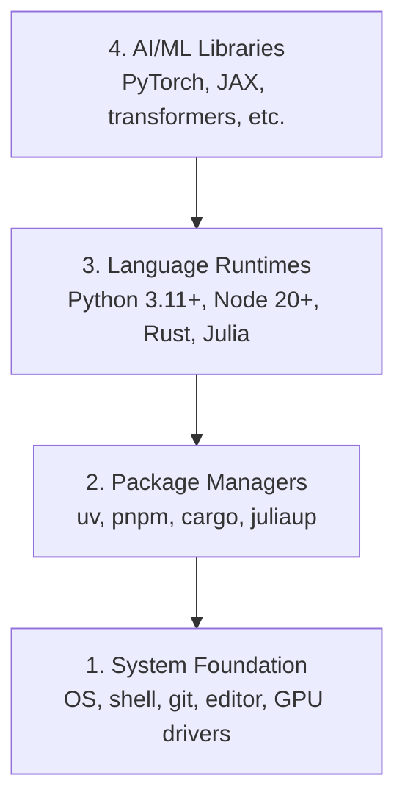

# विकास पर्यावरण

> आपके उपकरण आपकी सोच को आकार देते हैं, उन्हें एक बार सेट करें, उन्हें सही तरीके से सेट करें।

**Type:** Build
**Languages:** Python, Node.js, Rust
**Prerequisites:** None
**Time:** ~45 minutes

## सीखने के लक्ष्य

- पायथन 3.11+, नोड.जेएस 20+, और रस्ट टूलचैन को खरोंच से सेट करें
- पुनः प्रयोज्य बिल्ड के लिए वर्चुअल वातावरण और पैकेज प्रबंधक कॉन्फ़िगर करें
- CUDA/MPS के साथ GPU एक्सेस की जांच करें और एक टेस्ट टेंसर ऑपरेशन चलाएं
- चार-परत स्टैक को समझेंः सिस्टम, पैकेज, रनटाइम, एआई लाइब्रेरी

## समस्या

आप पायथन, टाइपस्क्रिप्ट, रुस्ट और जूलिया का उपयोग करके 500 से अधिक पाठों में एआई इंजीनियरिंग सीखने वाले हैं। यदि आपका वातावरण टूट जाता है, तो प्रत्येक पाठ सीखने के बजाय उपकरण बनाने के खिलाफ लड़ाई बन जाता है।

अधिकांश लोग पर्यावरण सेटअप छोड़ देते हैं, फिर वे आयात त्रुटियों, संस्करण संघर्षों और गायब CUDA ड्राइवरों डिबगिंग के लिए घंटे बिताते हैं. हम इसे एक बार करने जा रहे हैं, ठीक से.

## अवधारणा

एआई इंजीनियरिंग वातावरण में चार परतें होती हैंः



हम नीचे से ऊपर स्थापित करते हैं. प्रत्येक परत उसके नीचे की एक पर निर्भर करता है.

```figure
s0-env-stack
```

## इसे बनाओ

### चरण 1: सिस्टम फाउंडेशन

अपने सिस्टम की जाँच करें और मूल बातें स्थापित करें.

```bash
# macOS
xcode-select --install
brew install git curl wget

# Ubuntu/Debian
sudo apt update && sudo apt install -y build-essential git curl wget

# Windows (use WSL2)
wsl --install -d Ubuntu-24.04
```
wsl --install -d Ubuntu-24.04 यह त्रुटि दे सकता है के रूप में विशिष्ट संस्करण का उल्लेख किया है समस्या बस डाल दिया है 
wsl --install -d उबंटू

### चरण 2: यूवी के साथ पायथन

हम उपयोग करते हैं`uv` यह पाइप से 10-100 गुना तेज है और आभासी वातावरण को स्वचालित रूप से संभालता है।

```bash
curl -LsSf https://astral.sh/uv/install.sh | sh      #if using windows remember to use bash instead of powershell

uv python install 3.12

#to install pyhton globally in powershell using windpws package manager winget install -e --id Python.Python.3.12

uv venv
source .venv/bin/activate  # or .venv\Scripts\activate on Windows
#I used  source .venv/Scripts/activate  to activate the virtual environment in bash in windows 

uv pip install numpy matplotlib jupyter
```

सत्यापित करेंः

यह सत्यापित करने के लिए कि पायथन पहले से ही यूवी पैकेज प्रबंधक का उपयोग कर स्थापित किया गया था बस Bash में पायथन टाइप करें यह पायथन व्याख्याता खोलेगा

```python
import sys
print(f"Python {sys.version}")

import numpy as np
print(f"NumPy {np.__version__}")
a = np.array([1, 2, 3])
print(f"Vector: {a}, dot product with itself: {np.dot(a, a)}")
```

### चरण 3: pnpm के साथ Node.js

टाइपस्क्रिप्ट पाठों (एजेंट, एमसीपी सर्वर, वेब ऐप) के लिए।

```bash 
fnm stands for Fast Node Manager. It's a Node.js version manager written in Rust that lets you:

What it does:

Install and switch between multiple versions of Node.js
Manage Node.js versions per project or globally
Automatically use the right Node.js version for each project

```

```bash
You can't install fnm with uv because fnm is a Node.js version manager (not a Python package), while uv is for Python package

```

```bash
curl -fsSL https://fnm.vercel.app/install | bash
# for me above command curl didn't worked use in powershell winget install Schniz.fnm
# restart the terminal or open a new terminal cmd  whatever
fnm install 22
fnm use 22

npm install -g pnpm

node -e "console.log('Node', process.version)"
```

जैसा कि मैंने winget install schniz.fnm का उपयोग करके स्थापित किया 
```bash

Start with step 3 if this command does not work notepad $PROFILE then follow 
No problem — your PowerShell profile folder/file doesn't exist yet. Let's create it.

Run these one by one in PowerShell:

Step 1
 New-Item -ItemType Directory -Force -Path (Split-Path $PROFILE)


Then:
Step 2 
New-Item -ItemType File -Force -Path $PROFILE


Now open it:
Step 3
notepad $PROFILE


Paste this line into Notepad:
Step 4
fnm env --use-on-cd | Out-String | Invoke-Expression


Save and close Notepad.

Then close the PowerShell/VS Code terminal and open a new one.

Test:

Step 5
fnm --version


Then:

fnm install 22

// below command was not working  current PowerShell session still isn't loading the FNM environment.

Troubleshoot
Perfect 👍 FNM is working now.

That warning just means Node.js 22.23.2 is already installed, so you don't need to install it again.

Run:

fnm use 22


Then:

node -v


You should see:

v22.23.2


And check npm:

npm -v

If fnm use 22 works

You're all set. 🎉

For your AI Engineering From Scratch project, you can now run:

npm init -y


or, if you're starting a project with a framework, we can set that up next.

still if fnm use 22 doesn't work then

Got it — FNM itself is installed, but your current PowerShell session still isn't loading the FNM environment.

Let's fix it directly.

1. Check your profile path

Run:

echo $PROFILE


It should show something like:

C:\Users\deepa\Documents\WindowsPowerShell\Microsoft.PowerShell_profile.ps1

2. Add FNM to the profile automatically

Run this exact command:

"fnm env --use-on-cd | Out-String | Invoke-Expression" | Add-Content -Path $PROFILE

3. Load the profile immediately

Instead of restarting, run:

. $PROFILE


Then check:

fnm env


You should see several environment-variable commands.

4. Now use Node 22
fnm use 22


Then:

node -v


Expected:

v22.23.2

If you still get the same error

Run these two commands and send me the output:

echo $PROFILE


and

Get-Content $PROFILE


I'll tell you exactly what needs to be changed.
fnm use 22
node -v


You should get a Node version beginning with v22.


still use not working was getting 3 lines

Great — your profile is correct and FNM is configured. You just have the same line 3 times, which isn't necessary.

Let's clean it up and make sure it loads correctly.

1. Replace your profile with one FNM line

Run:

Set-Content $PROFILE 'fnm env --use-on-cd | Out-String | Invoke-Expression'


Now verify:

Get-Content $PROFILE


You should see only one line:

fnm env --use-on-cd | Out-String | Invoke-Expression

2. Reload the profile

Run:

. $PROFILE

3. Check FNM

Run:

fnm --version


You should get:

1.39.0

4. Use Node 22

Now run:

fnm use 22


Then:

node -v


You should get:

v22.23.2

If it STILL gives the environment-variable error

Run:

fnm env


and send me the output. Don't reinstall Node or FNM yet — your installation appears fine; we're just fixing the PowerShell environment.

then if this is the error shown in powershell


PS C:\Users\deepa\OneDrive\Desktop\AI Engineering From Scratch> . $PROFILE
. : File C:\Users\deepa\OneDrive\Documents\WindowsPowerShell\Microsoft.PowerShell_profile.ps1 cannot be loaded because
running scripts is disabled on this system. For more information, see about_Execution_Policies at
https:/go.microsoft.com/fwlink/?LinkID=135170.
At line:1 char:3
+ . $PROFILE
+   ~~~~~~~~
    + CategoryInfo          : SecurityError: (:) [], PSSecurityException
    + FullyQualifiedErrorId : UnauthorizedAccess

then

Aha — now we found the actual problem. 👍

FNM is installed correctly. Your PowerShell execution policy is blocking your profile script from running.

Let's fix that.

1. Allow your PowerShell profile to run

Run this in PowerShell:

Set-ExecutionPolicy -ExecutionPolicy RemoteSigned -Scope CurrentUser


If PowerShell asks:

Execution Policy Change
[Y] Yes  [A] Yes to All  [N] No ...


Type:

Y


and press Enter.

2. Load your profile

Now run:

. $PROFILE


There should be no error.

3. Use Node 22
fnm use 22


Then:

node -v


You should get:

v22.23.2


And:

npm -v

4. Verify everything

You can run:

fnm current
node -v
npm -v


If node -v shows v22.23.2, you're completely set. 🚀

Don't reinstall FNM or Node. The issue was simply PowerShell's script execution policy.


```


**macOS / Apple Silicon (M1/M2/M3/M4):**यदि इंस्टॉलर के साथ बंद हो जाता है `Error: Cannot install under Rosetta 2 in ARM default prefix (/opt/homebrew)`, आपका टर्मिनल Rosetta 2 के तहत चल रहा है (`arch`छापें `i386`जबकि Homebrew एक मूल arm64 निर्माण है. fnm बल arm64 स्थापित करें, इसे अपने खोल में तार, फिर ऊपर से आदेशों को फिर से चलाएँ.`fnm install 22`:

```bash
arch -arm64 brew install fnm
echo 'eval "$(fnm env --use-on-cd)"' >> ~/.zshrc
source ~/.zshrc
```

### चरण 4: जंग

प्रदर्शन-महत्वपूर्ण पाठों के लिए (उल्लेखना, प्रणालियों)

```bash
curl --proto '=https' --tlsv1.2 -sSf https://sh.rustup.rs | sh

# for me in windows winget install Rustlang.Rustup installed globally


rustc --version
cargo --version
```

### चरण 5: जूलिया (वैकल्पिक)

गणित के भारी पाठों के लिए जहां जूलिया चमकती है।

```bash
curl -fsSL https://install.julialang.org | sh  #for me used windows package manager winget install julia -s msstore

julia -e 'println("Julia ", VERSION)'
```

### चरण 6: GPU सेटअप (यदि आपके पास एक है)

**NVIDIA (Linux / Windows):**

```bash
nvidia-smi

# Install PyTorch with CUDA
uv pip install torch torchvision torchaudio --index-url https://download.pytorch.org/whl/cu124
```

**macOS / Apple Silicon (M1/M2/M3/M4):**मैक पर कोई CUDA नहीं है जो अपेक्षित है, कोई विफलता नहीं है।**not**पास `--index-url .../cuXXX`(वे पहियों केवल लिनक्स / विंडोज हैं, इसलिए स्थापना विफल होती है) सादा बिल्ड स्थापित करें, जिसमें एप्पल के एमपीएस (मेटल) जीपीयू बैकेंड शामिल हैः

```bash
uv pip install torch torchvision torchaudio
```

सत्यापित करें (किसी भी प्लेटफॉर्म पर काम करता है):

```python
import torch
print(f"CUDA available: {torch.cuda.is_available()}")           # False on macOS — expected
print(f"MPS available:  {torch.backends.mps.is_available()}")   # True on Apple Silicon
if torch.cuda.is_available():
    print(f"GPU: {torch.cuda.get_device_name(0)}")
```

कोई GPU नहीं? कोई समस्या नहीं. अधिकांश पाठ CPU पर काम करते हैं. प्रशिक्षण-भारी पाठ के लिए, Google Colab या क्लाउड GPU का उपयोग करें.

### चरण 7: जिस मार्ग से आप आरंभ करना चाहते हैं, उसे सत्यापित करें

इस पाठ में प्रत्येक आदेश को भंडारण रूट से चलाएं, निर्देशिका जो
`README.md`और `phases/`उड़ान से पहले केवल वही जांचता है जो आपको चाहिए
यह बाद के उपकरणों को डिफ़ॉल्ट रूप से छोड़ देता है ताकि एक नया छात्र देख सके
चेतावनी की दीवार के बजाय एक स्पष्ट उत्तर।

शुरुआत की पूरी अनुक्रम शुरू करेंः

verify.py कोड समझाएँ 

```python
I'll break down this environment preflight checker for AI Engineering from Scratch:

## **Module Docstring (Lines 1-4)**
```python
"""एआई इंजीनियरिंग के लिए मार्ग-जागरूक वातावरण पूर्व उड़ान खरोंच से।

पाठः चरण/00-संचलन और उपकरण/01-विकास पर्यावरण/डॉक्स/en.md
सीखने के मार्ग शुरू करने से पहले इस फ़ाइल को भंडारण रूट से चलाएं।
"
```
Explains the script's purpose: check if your system has the required tools before starting the course.

## **Imports (Lines 6-17)**
Standard libraries for running system checks:
- `argparse` — parse command-line arguments
- `importlib.util` — check if Python modules exist
- `platform` — detect OS (Windows/Mac/Linux)
- `subprocess` — run shell commands
- `dataclasses` — define structured data

## **Data Classes (Lines 20-37)**

**`Result`** — stores check outcome:
```python
@dataclass(मुस्कुराया=सच)
वर्ग परिणामः
    ठीक है: bool # True/False
    विवरणः str # मानव-पठनीय संदेश
```

**`Probe`** — defines a single check:
```python
@dataclass(मुस्कुराया=सच)
वर्ग जांचः
    लेबलः str # उदाहरण के लिए, "पाइटन 3.11+"
    run: Callable[[], Result] # फ़ंक्शन जो इसे जांचता है
    ठीक करेंः str # जाँच विफलता के मामले में निर्देशों को ठीक करें
```

**`Route`** — defines a learning path:
```python
@dataclass(मुस्कुराया=सच)
वर्ग मार्गः
    लेबलः str # उदाहरण के लिए, "शुरूआती पाठ्यक्रम"
    आवश्यकः टपल # आवश्यक उपकरण
    वैकल्पिकः टपल # अच्छा करने के लिए उपकरण
    next_command: str # चेक पास होने के बाद क्या चलाना है
    मैनुअलः टप्पर = () # अतिरिक्त मैनुअल कदम
```

## **Check Functions (Lines 40-85)**

**`command_result()`** — checks if a command exists and has min version:
1. Find command on PATH using `shutil.which()`
2. Run `--version` to get version string
3. If `minimum_major` specified, parse and compare version numbers
4. Return Result object

**`python_result()`** — checks Python 3.11+:
1. Get current Python version and executable path
2. Compare against minimum (3.11)
3. Return detailed Result

**`module_result()`** — checks if a Python module is installed:
1. Use `importlib.util.find_spec()` to check if module exists
2. Return Result with import path

**`gpu_result()`** — checks for GPU acceleration (CUDA or Apple MPS):
1. Check if PyTorch is installed
2. Check if CUDA is available
3. Check if Apple MPS is available
4. Otherwise return "CPU only"

**`git_fix()`** — returns OS-specific instructions to install Git:
- macOS: `xcode-select --install`
- Windows: `winget install --id Git.Git`
- Linux: `apt-get install git`

## **PROBES Dictionary (Lines 92-134)**
Defines all checkable tools:
```python
प्रूफ = {
    "पायथन": जांच(...), #पायथन 3.11+
    "git": जांच(...), # Git संस्करण नियंत्रण
    "नोड": जांच(...), #नोड.जेएस 20+
    "npx": जांच(...), # npm पैकेज रनर
    "कार्गो": प्रोब(...), # रस्ट पैकेज मैनेजर
    "जुलिया": जांच(...), #जुलिया भाषा
    "numpy": Probe(...), # पायथन डेटा लाइब्रेरी
    "फॉर्च": प्रोब(...), #पाइटॉर्च एमएल लाइब्रेरी
    # ... आदि
}
```

## **BASE_OPTIONAL (Line 137)**
Tools that are optional for beginners but needed for specific routes.

## **ROUTES Dictionary (Lines 139-197)**
Defines learning paths:
- **beginner** — just Python and Git
- **ml-foundations** — adds NumPy, Matplotlib, Jupyter
- **llm-engineering** — adds PyTorch, potentially GPU
- **agents** — for agent engineering track
- **mcp** — for Model Context Protocol track
- **agent-skills** — requires Node.js (host SDKs)
- **certification** — Claude certification prep

Each route specifies:
- Required tools (must pass)
- Optional tools (nice-to-have)
- Next command to run if all checks pass

## **parse_args() (Lines 200-215)**
Parses command-line arguments:
```bash
python सत्यापित करें.py --मार्ग शुरुआत --शो-बाद में
```
- `--route` — pick which learning path to check
- `--show-later` — also show optional tools

## **print_probe() (Lines 218-232)**
Runs one check and displays result:
1. Run the probe's check function
2. Print [PASS], [FAIL], or [LATER]
3. Show detail message
4. If failed, show fix instructions
5. Return True if passed

## **main() (Lines 235-269)**
Main execution:
1. Parse command-line args
2. Get the selected route
3. Run all required checks
4. Optionally show later/optional checks
5. Display manual steps if any
6. Print summary and next command
7. Return exit code (0 if all passed, 1 if failed)

## **Entry Point (Line 272-273)**
```python
यदि __name__== "__main__":
    SystemExit को बढ़ाएं
```
Runs `main()` when script is executed directly.

---

**TL;DR:** This script checks if you have all required tools (Python, Git, Node, etc.) for your chosen learning route before starting AI Engineering from Scratch lessons.
```

```bash
python3 phases/00-setup-and-tooling/01-dev-environment/code/verify.py --route beginner
```

या केवल मार्ग की जाँच करें आप चाहते हैंः

```bash
python3 phases/00-setup-and-tooling/01-dev-environment/code/verify.py --route ml-foundations
python3 phases/00-setup-and-tooling/01-dev-environment/code/verify.py --route llm-engineering
python3 phases/00-setup-and-tooling/01-dev-environment/code/verify.py --route agents
python3 phases/00-setup-and-tooling/01-dev-environment/code/verify.py --route mcp
python3 phases/00-setup-and-tooling/01-dev-environment/code/verify.py --route agent-skills
python3 phases/00-setup-and-tooling/01-dev-environment/code/verify.py --route certification
```

जोड़ें `--show-later`जब आप वैकल्पिक उपकरण का निरीक्षण करने के लिए एक ही पूर्व उड़ान चाहते हैं
एक अनुपस्थित बाद के उपकरण कभी भी
चयनित मार्ग।

प्रत्येक असफल आवश्यक जांच में पता चला पथ या आयात त्रुटि और एक
एजेंट कौशल और प्रमाणन मार्गों भी दिखाता है
मैनुअल होस्ट जांच क्योंकि एक पायथन स्क्रिप्ट साबित नहीं कर सकता है कि एक एआई होस्ट है
किसी कौशल की खोज की या आपके द्वारा चुने गए कौशल का दायरा लिखना योग्य है।

जब शुरुआती प्री-फ्लाइट गुजरता है, यह सटीक पहला चलाने योग्य पाठ प्रिंट करता हैः

```text
Ready to start Beginner course.
Next: python3 phases/01-math-foundations/01-linear-algebra-intuition/code/vectors.py
```

## इसका प्रयोग करें

आपके पर्यावरण को आपके द्वारा जाँच किए गए मार्ग को शुरू करने के लिए तैयार है। बाद के उपकरण स्थापित करें
जब एक पाठ आपके पहले पाठ को पूरी तरह से अवरुद्ध करने के बजाय उनके लिए पूछता है
यहाँ है कि आप पाठ्यक्रम में उपयोग करेंगेः

| Language | Used In | Package Manager |
|----------|---------|-----------------|
| Python | Phases 1-12 (ML, DL, NLP, Vision, Audio, LLMs) | uv |
| TypeScript | Phases 13-17 (Tools, Agents, Swarms, Infra) | pnpm |
| Rust | Phases 12, 15-17 (Performance-critical systems) | cargo |
| Julia | Phase 1 (Math foundations) | Pkg |

## इसे भेजें

इस पाठ में एक सत्यापन स्क्रिप्ट उत्पन्न होती है जिसे कोई भी अपनी सेटिंग की जांच करने के लिए चला सकता है।

देखो`outputs/prompt-env-check.md`एक संकेत के लिए जो एआई सहायकों को पर्यावरण के मुद्दों का निदान करने में मदद करता है।

## व्यायाम

1. सत्यापन स्क्रिप्ट चलाएँ और किसी भी विफलता को ठीक करें
2. इस पाठ्यक्रम के लिए एक पायथन आभासी वातावरण बनाएं और PyTorch स्थापित करें
3. चार भाषाओं में "हैलो वर्ल्ड" लिखें और प्रत्येक को चलाएं
