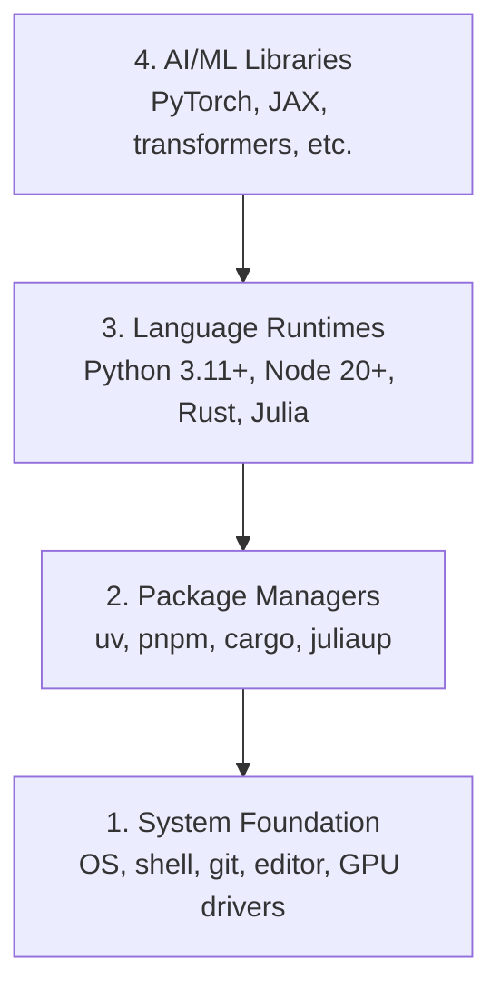

# Dev Çevre

> Aletlerin düşüncelerini şekillendirir.

**Type:** Build
**Languages:** Python, Node.js, Rust
**Prerequisites:** None
**Time:** ~45 minutes

## Öğrenme Hedefleri

- Python 3.11+, Node.js 20+ ve Rust araç zincirlerini sıfırdan kur
- Tekrarlanabilir yapılandırmalar için sanal ortamları ve paket yöneticilerini yapılandır
- CUDA/MPS ile GPU erişimini doğrulayın ve test tenzor işlemini çalıştırın
- Dört katmanlı yığını anlayın: sistem, paketler, çalıştırma zamanları, AI kütüphaneleri

## Sorun

Python, TypeScript, Rust ve Julia'yı kullanarak 500+ ders boyunca AI mühendisliği öğrenmek üzeresiniz. Eğer çevrenizin bozulursa, her ders öğrenmek yerine araçlarla mücadeleye dönüşür.

Çoğu insan çevre ayarını atlıyor, sonra saatlerce import hatalarını, sürüm çatışmalarını ve kayıp CUDA sürücülerini düzeltmeye çalışıyor.

## Anlaşım

Yapay zeka mühendisliği ortamı dört katman içerir:



Her katman altındaki katmanlara bağlı.

```figure
s0-env-stack
```

## Yapın

### Adım 1: Sistem Temel

Sistemini kontrol et ve temel şeyleri yükle.

```bash
# macOS
xcode-select --install
brew install git curl wget

# Ubuntu/Debian
sudo apt update && sudo apt install -y build-essential git curl wget

# Windows (use WSL2)
wsl --install -d Ubuntu-24.04
```
wsl --install -d Ubuntu-24.04 bu hata verebilir çünkü özel sürümde belirtilen sorun basitçe konuldu 
wsl --install -d Ubuntu

### Adım 2: UV ile Python

Kullanıyoruz .`uv` pip'ten 10-100 kat daha hızlı ve sanal ortamları otomatik olarak ele alır.

```bash
curl -LsSf https://astral.sh/uv/install.sh | sh      #if using windows remember to use bash instead of powershell

uv python install 3.12

uv venv
source .venv/bin/activate  # or .venv\Scripts\activate on Windows
#I used  source .venv/Scripts/activate  to activate the virtual environment in bash in windows 

uv pip install numpy matplotlib jupyter
```

Kontrol edin:

Python'un zaten yüklendiğini UV paket yöneticisi ile doğrultmak için Python'u bash'te yazın Python tercümanı açılır

```python
import sys
print(f"Python {sys.version}")

import numpy as np
print(f"NumPy {np.__version__}")
a = np.array([1, 2, 3])
print(f"Vector: {a}, dot product with itself: {np.dot(a, a)}")
```

### Adım 3: pnpm ile Node.js

TypeScript dersleri için (ajanlar, MCP sunucular, web uygulamaları).

```bash 
fnm stands for Fast Node Manager. It's a Node.js version manager written in Rust that lets you:

What it does:

Install and switch between multiple versions of Node.js
Manage Node.js versions per project or globally
Automatically use the right Node.js version for each project

```

```bash
You can't install fnm with uv because fnm is a Node.js version manager (not a Python package), while uv is for Python package

```

```bash
curl -fsSL https://fnm.vercel.app/install | bash
# for me above command curl didn't worked use in powershell winget install Schniz.fnm
# restart the terminal or open a new terminal cmd  whatever
fnm install 22
fnm use 22

npm install -g pnpm

node -e "console.log('Node', process.version)"
```

winget ile yüklediğim gibi schniz.fnm yükle
```bash

Start with step 3 if this command does not work notepad $PROFILE then follow 
No problem — your PowerShell profile folder/file doesn't exist yet. Let's create it.

Run these one by one in PowerShell:

Step 1
 New-Item -ItemType Directory -Force -Path (Split-Path $PROFILE)


Then:
Step 2 
New-Item -ItemType File -Force -Path $PROFILE


Now open it:
Step 3
notepad $PROFILE


Paste this line into Notepad:
Step 4
fnm env --use-on-cd | Out-String | Invoke-Expression


Save and close Notepad.

Then close the PowerShell/VS Code terminal and open a new one.

Test:

Step 5
fnm --version


Then:

fnm install 22

// below command was not working  current PowerShell session still isn't loading the FNM environment.

Troubleshoot
Perfect 👍 FNM is working now.

That warning just means Node.js 22.23.2 is already installed, so you don't need to install it again.

Run:

fnm use 22


Then:

node -v


You should see:

v22.23.2


And check npm:

npm -v

If fnm use 22 works

You're all set. 🎉

For your AI Engineering From Scratch project, you can now run:

npm init -y


or, if you're starting a project with a framework, we can set that up next.

still if fnm use 22 doesn't work then

Got it — FNM itself is installed, but your current PowerShell session still isn't loading the FNM environment.

Let's fix it directly.

1. Check your profile path

Run:

echo $PROFILE


It should show something like:

C:\Users\deepa\Documents\WindowsPowerShell\Microsoft.PowerShell_profile.ps1

2. Add FNM to the profile automatically

Run this exact command:

"fnm env --use-on-cd | Out-String | Invoke-Expression" | Add-Content -Path $PROFILE

3. Load the profile immediately

Instead of restarting, run:

. $PROFILE


Then check:

fnm env


You should see several environment-variable commands.

4. Now use Node 22
fnm use 22


Then:

node -v


Expected:

v22.23.2

If you still get the same error

Run these two commands and send me the output:

echo $PROFILE


and

Get-Content $PROFILE


I'll tell you exactly what needs to be changed.
fnm use 22
node -v


You should get a Node version beginning with v22.


still use not working was getting 3 lines

Great — your profile is correct and FNM is configured. You just have the same line 3 times, which isn't necessary.

Let's clean it up and make sure it loads correctly.

1. Replace your profile with one FNM line

Run:

Set-Content $PROFILE 'fnm env --use-on-cd | Out-String | Invoke-Expression'


Now verify:

Get-Content $PROFILE


You should see only one line:

fnm env --use-on-cd | Out-String | Invoke-Expression

2. Reload the profile

Run:

. $PROFILE

3. Check FNM

Run:

fnm --version


You should get:

1.39.0

4. Use Node 22

Now run:

fnm use 22


Then:

node -v


You should get:

v22.23.2

If it STILL gives the environment-variable error

Run:

fnm env


and send me the output. Don't reinstall Node or FNM yet — your installation appears fine; we're just fixing the PowerShell environment.

then if this is the error shown in powershell


PS C:\Users\deepa\OneDrive\Desktop\AI Engineering From Scratch> . $PROFILE
. : File C:\Users\deepa\OneDrive\Documents\WindowsPowerShell\Microsoft.PowerShell_profile.ps1 cannot be loaded because
running scripts is disabled on this system. For more information, see about_Execution_Policies at
https:/go.microsoft.com/fwlink/?LinkID=135170.
At line:1 char:3
+ . $PROFILE
+   ~~~~~~~~
    + CategoryInfo          : SecurityError: (:) [], PSSecurityException
    + FullyQualifiedErrorId : UnauthorizedAccess

then

Aha — now we found the actual problem. 👍

FNM is installed correctly. Your PowerShell execution policy is blocking your profile script from running.

Let's fix that.

1. Allow your PowerShell profile to run

Run this in PowerShell:

Set-ExecutionPolicy -ExecutionPolicy RemoteSigned -Scope CurrentUser


If PowerShell asks:

Execution Policy Change
[Y] Yes  [A] Yes to All  [N] No ...


Type:

Y


and press Enter.

2. Load your profile

Now run:

. $PROFILE


There should be no error.

3. Use Node 22
fnm use 22


Then:

node -v


You should get:

v22.23.2


And:

npm -v

4. Verify everything

You can run:

fnm current
node -v
npm -v


If node -v shows v22.23.2, you're completely set. 🚀

Don't reinstall FNM or Node. The issue was simply PowerShell's script execution policy.


```


**macOS / Apple Silicon (M1/M2/M3/M4):**Eğer yüklemeci `Error: Cannot install under Rosetta 2 in ARM default prefix (/opt/homebrew)`... terminaliniz Rosetta 2 altında çalışıyor .`arch`Parmak izi`i386`HomeBrew, yerel bir arm64 yapılandırması iken, fnm zorlayıcı arm64'i yükle, kabloya bağla, sonra yukarıdaki komutları tekrar çalıştır.`fnm install 22`- ...

```bash
arch -arm64 brew install fnm
echo 'eval "$(fnm env --use-on-cd)"' >> ~/.zshrc
source ~/.zshrc
```

### Dördüncü adım: Kırmızı

Performans kritik dersleri için (sürekli, sistemler).

```bash
curl --proto '=https' --tlsv1.2 -sSf https://sh.rustup.rs | sh

rustc --version
cargo --version
```

### Adım 5: Julia (Önlü)

Julia'nın parladığı ağır matematik dersleri için.

```bash
curl -fsSL https://install.julialang.org | sh  #for me used windows package manager winget install julia -s msstore

julia -e 'println("Julia ", VERSION)'
```

### Adım 6: GPU Kurulum (Biriniz varsa)

**NVIDIA (Linux / Windows):**

```bash
nvidia-smi

# Install PyTorch with CUDA
uv pip install torch torchvision torchaudio --index-url https://download.pytorch.org/whl/cu124
```

**macOS / Apple Silicon (M1/M2/M3/M4):**Mac'de beklenen CUDA yok, başarısızlık yok.**not**Geçit .`--index-url .../cuXXX`(o tekerlekler sadece Linux/Windows'dur, bu yüzden kurulum başarısız olur).

```bash
uv pip install torch torchvision torchaudio
```

Verify (herhangi bir platformda çalışır):

```python
import torch
print(f"CUDA available: {torch.cuda.is_available()}")           # False on macOS — expected
print(f"MPS available:  {torch.backends.mps.is_available()}")   # True on Apple Silicon
if torch.cuda.is_available():
    print(f"GPU: {torch.cuda.get_device_name(0)}")
```

Bir GPU yok? Sorun yok. Çoğu ders CPU'da çalışır. Eğitim ağır dersler için Google Colab veya bulut GPU'ları kullanın.

### Adım 7: Başlamak istediğiniz rotayi doğrulayın

Bu dersdeki her komutu deposu kökü, dizini,
içerir`README.md`ve `phases/`Uçuş öncesi kontrol sadece ihtiyacınız olan şeyi .
Seçilen yolu başlatır. Öntanımlı olarak daha sonraki araçları atlar böylece yeni öğrenci
Bir duvar uyarı yerine açık bir cevap.

Tam başlangıç dizisini başlat:

```bash
python3 phases/00-setup-and-tooling/01-dev-environment/code/verify.py --route beginner
```

Ya da sadece istediğiniz yolu kontrol edin:

```bash
python3 phases/00-setup-and-tooling/01-dev-environment/code/verify.py --route ml-foundations
python3 phases/00-setup-and-tooling/01-dev-environment/code/verify.py --route llm-engineering
python3 phases/00-setup-and-tooling/01-dev-environment/code/verify.py --route agents
python3 phases/00-setup-and-tooling/01-dev-environment/code/verify.py --route mcp
python3 phases/00-setup-and-tooling/01-dev-environment/code/verify.py --route agent-skills
python3 phases/00-setup-and-tooling/01-dev-environment/code/verify.py --route certification
```

Ekle`--show-later`Aynı uçuş öncesi araçları kontrol etmek istediğinizde
Kayıp bir sonraki araç asla
Seçilen rota.

Her başarısız gerekli kontrol, tespit edilen yol veya ithalat hatası ve
Ajan yetenekleri ve sertifika yolları da gösterir
Python scriptinin bir AI host'ın sahip olduğunu kanıtlayamadığı için manuel host kontrolleri
Bir beceri keşfetmişsin ya da seçtiğin beceri alanının yazılabilir olduğunu.

İlk uçuş öncesi uçuş geçince, tam olarak ilk ders yazdırır:

```text
Ready to start Beginner course.
Next: python3 phases/01-math-foundations/01-linear-algebra-intuition/code/vectors.py
```

## Kullan

Çevre kontrol ettiğiniz rota başlatmak için hazır.
Bir dersin ilk dersini tamamen engellemek yerine, onlardan istediklerinde
İşte tüm programda kullanacağınız:

| Language | Used In | Package Manager |
|----------|---------|-----------------|
| Python | Phases 1-12 (ML, DL, NLP, Vision, Audio, LLMs) | uv |
| TypeScript | Phases 13-17 (Tools, Agents, Swarms, Infra) | pnpm |
| Rust | Phases 12, 15-17 (Performance-critical systems) | cargo |
| Julia | Phase 1 (Math foundations) | Pkg |

## Gönder

Bu ders, herkesin ayarlarını kontrol etmek için çalıştırabileceği bir doğrulama senaryosunu üretir.

Bakın .`outputs/prompt-env-check.md`Yapay zeka asistanlarının çevre sorunlarını teşhis etmesine yardımcı olan bir istek için.

## Egzersizler

1. Doğrulama senaryosunu çalıştır ve herhangi bir hataları düzelt
2. Bu ders için Python sanal ortamı oluşturun ve PyTorch yükleyin
3. Dört dilde "hello world" yaz ve her birini çalıştır
