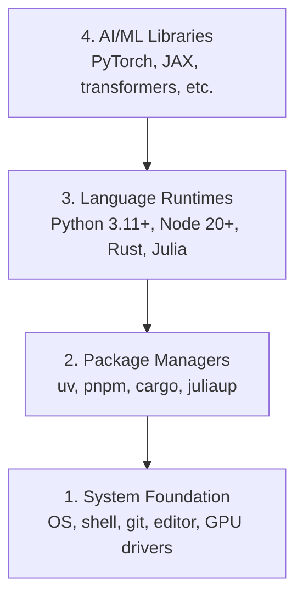

# 开发环境

> 你的工具塑造了你的思维, 设置它们一次,设置它们正确.

**Type:** Build
**Languages:** Python, Node.js, Rust
**Prerequisites:** None
**Time:** ~45 minutes

## 学习目标

- 设置Python 3.11+,Node.js 20+,以及Rust工具链从零开始
- 配置可复制的构建的虚拟环境和包管理器
- 通过CUDA/MPS验证GPU访问并执行测试子操作
- 了解四层堆:系统,包,运行时间,人工智能库

## 问题

你即将学习人工智能工程,使用Python,TypeScript,Rust和Julia的500多个课程. 如果你的环境被破坏,

大多数人会跳过环境设置,然后花费数小时检查进口错误,版本冲突,以及缺失的CUDA驱动程序.

## 概念

人工智能工程环境有四层:



我们安装下层,每个层取决于下层.

```figure
s0-env-stack
```

## 建立它

### 步骤1:系统基础

检查系统,安装基本知识.

```bash
# macOS
xcode-select --install
brew install git curl wget

# Ubuntu/Debian
sudo apt update && sudo apt install -y build-essential git curl wget

# Windows (use WSL2)
wsl --install -d Ubuntu-24.04
```
由于该版本的具体版本,问题只是被放下
wsl --install -d Ubuntu

### 步骤2:使用UV的Python

我们使用`uv`它比Pip快10-100倍,并且自动处理虚拟环境.

```bash
curl -LsSf https://astral.sh/uv/install.sh | sh      #if using windows remember to use bash instead of powershell

uv python install 3.12

uv venv
source .venv/bin/activate  # or .venv\Scripts\activate on Windows
#I used  source .venv/Scripts/activate  to activate the virtual environment in bash in windows 

uv pip install numpy matplotlib jupyter
```

检查:

为了验证python已经安装了,使用UV包管理器,只需输入python在 bash中,它将打开python解释器

```python
import sys
print(f"Python {sys.version}")

import numpy as np
print(f"NumPy {np.__version__}")
a = np.array([1, 2, 3])
print(f"Vector: {a}, dot product with itself: {np.dot(a, a)}")
```

### 步骤3: Node.js 与 pnpm

对于TypeScript课程 (代理,MCP服务器,网络应用).

```bash 
fnm stands for Fast Node Manager. It's a Node.js version manager written in Rust that lets you:

What it does:

Install and switch between multiple versions of Node.js
Manage Node.js versions per project or globally
Automatically use the right Node.js version for each project

```

```bash
You can't install fnm with uv because fnm is a Node.js version manager (not a Python package), while uv is for Python package

```

```bash
curl -fsSL https://fnm.vercel.app/install | bash
# for me above command curl didn't worked use in powershell winget install Schniz.fnm
# restart the terminal or open a new terminal cmd  whatever
fnm install 22
fnm use 22

npm install -g pnpm

node -e "console.log('Node', process.version)"
```

像我使用 winget 安装 schniz.fnm 安装一样
```bash

Start with step 3 if this command does not work notepad $PROFILE then follow 
No problem — your PowerShell profile folder/file doesn't exist yet. Let's create it.

Run these one by one in PowerShell:

Step 1
 New-Item -ItemType Directory -Force -Path (Split-Path $PROFILE)


Then:
Step 2 
New-Item -ItemType File -Force -Path $PROFILE


Now open it:
Step 3
notepad $PROFILE


Paste this line into Notepad:
Step 4
fnm env --use-on-cd | Out-String | Invoke-Expression


Save and close Notepad.

Then close the PowerShell/VS Code terminal and open a new one.

Test:

Step 5
fnm --version


Then:

fnm install 22

// below command was not working  current PowerShell session still isn't loading the FNM environment.

Troubleshoot
Perfect 👍 FNM is working now.

That warning just means Node.js 22.23.2 is already installed, so you don't need to install it again.

Run:

fnm use 22


Then:

node -v


You should see:

v22.23.2


And check npm:

npm -v

If fnm use 22 works

You're all set. 🎉

For your AI Engineering From Scratch project, you can now run:

npm init -y


or, if you're starting a project with a framework, we can set that up next.

still if fnm use 22 doesn't work then

Got it — FNM itself is installed, but your current PowerShell session still isn't loading the FNM environment.

Let's fix it directly.

1. Check your profile path

Run:

echo $PROFILE


It should show something like:

C:\Users\deepa\Documents\WindowsPowerShell\Microsoft.PowerShell_profile.ps1

2. Add FNM to the profile automatically

Run this exact command:

"fnm env --use-on-cd | Out-String | Invoke-Expression" | Add-Content -Path $PROFILE

3. Load the profile immediately

Instead of restarting, run:

. $PROFILE


Then check:

fnm env


You should see several environment-variable commands.

4. Now use Node 22
fnm use 22


Then:

node -v


Expected:

v22.23.2

If you still get the same error

Run these two commands and send me the output:

echo $PROFILE


and

Get-Content $PROFILE


I'll tell you exactly what needs to be changed.
fnm use 22
node -v


You should get a Node version beginning with v22.


still use not working was getting 3 lines

Great — your profile is correct and FNM is configured. You just have the same line 3 times, which isn't necessary.

Let's clean it up and make sure it loads correctly.

1. Replace your profile with one FNM line

Run:

Set-Content $PROFILE 'fnm env --use-on-cd | Out-String | Invoke-Expression'


Now verify:

Get-Content $PROFILE


You should see only one line:

fnm env --use-on-cd | Out-String | Invoke-Expression

2. Reload the profile

Run:

. $PROFILE

3. Check FNM

Run:

fnm --version


You should get:

1.39.0

4. Use Node 22

Now run:

fnm use 22


Then:

node -v


You should get:

v22.23.2

If it STILL gives the environment-variable error

Run:

fnm env


and send me the output. Don't reinstall Node or FNM yet — your installation appears fine; we're just fixing the PowerShell environment.

then if this is the error shown in powershell


PS C:\Users\deepa\OneDrive\Desktop\AI Engineering From Scratch> . $PROFILE
. : File C:\Users\deepa\OneDrive\Documents\WindowsPowerShell\Microsoft.PowerShell_profile.ps1 cannot be loaded because
running scripts is disabled on this system. For more information, see about_Execution_Policies at
https:/go.microsoft.com/fwlink/?LinkID=135170.
At line:1 char:3
+ . $PROFILE
+   ~~~~~~~~
    + CategoryInfo          : SecurityError: (:) [], PSSecurityException
    + FullyQualifiedErrorId : UnauthorizedAccess

then

Aha — now we found the actual problem. 👍

FNM is installed correctly. Your PowerShell execution policy is blocking your profile script from running.

Let's fix that.

1. Allow your PowerShell profile to run

Run this in PowerShell:

Set-ExecutionPolicy -ExecutionPolicy RemoteSigned -Scope CurrentUser


If PowerShell asks:

Execution Policy Change
[Y] Yes  [A] Yes to All  [N] No ...


Type:

Y


and press Enter.

2. Load your profile

Now run:

. $PROFILE


There should be no error.

3. Use Node 22
fnm use 22


Then:

node -v


You should get:

v22.23.2


And:

npm -v

4. Verify everything

You can run:

fnm current
node -v
npm -v


If node -v shows v22.23.2, you're completely set. 🚀

Don't reinstall FNM or Node. The issue was simply PowerShell's script execution policy.


```


**macOS / Apple Silicon (M1/M2/M3/M4):**如果安装器停止使用`Error: Cannot install under Rosetta 2 in ARM default prefix (/opt/homebrew)`您的终端正在Rosetta 2下运行`arch`印记`i386`安装Fnm强迫Arm64,将其插入你的子中,然后从上面的命令重启`fnm install 22`其他:

```bash
arch -arm64 brew install fnm
echo 'eval "$(fnm env --use-on-cd)"' >> ~/.zshrc
source ~/.zshrc
```

### 步骤4: 

对于性能关键的课程 (推理,系统).

```bash
curl --proto '=https' --tlsv1.2 -sSf https://sh.rustup.rs | sh

rustc --version
cargo --version
```

### 步骤5:朱莉亚 (可选)

对于朱莉亚耀的数学课程.

```bash
curl -fsSL https://install.julialang.org | sh  #for me used windows package manager winget install julia -s msstore

julia -e 'println("Julia ", VERSION)'
```

### 步骤 6: 设置GPU (如果您有一个)

**NVIDIA (Linux / Windows):**

```bash
nvidia-smi

# Install PyTorch with CUDA
uv pip install torch torchvision torchaudio --index-url https://download.pytorch.org/whl/cu124
```

**macOS / Apple Silicon (M1/M2/M3/M4):**没有一个Mac上 CUDA 预期,没有失败.**not**通过`--index-url .../cuXXX`安装简单的构建,其中包括果的MPS (金属) GPU后端:

```bash
uv pip install torch torchvision torchaudio
```

验证 (在任何平台上都能工作):

```python
import torch
print(f"CUDA available: {torch.cuda.is_available()}")           # False on macOS — expected
print(f"MPS available:  {torch.backends.mps.is_available()}")   # True on Apple Silicon
if torch.cuda.is_available():
    print(f"GPU: {torch.cuda.get_device_name(0)}")
```

没有GPU?没有问题.大多数课程都在CPU上进行.对于训练重的课程,请使用Google Colab或云GPU.

### 步骤 7: 验证您想要开始的路线

运行本课中的每个命令从库根,目录中运行
含有`README.md`其他`phases/`飞行前检查你需要的东西
默认情况下,它会跳过后来的工具,这样一个新学习者会看到
只是一个明确的答案,而不是一个警告墙.

开始全新手序列:

查看.py 解释代码

```python
I'll break down this environment preflight checker for AI Engineering from Scratch:

## **Module Docstring (Lines 1-4)**
```python
"从零开始的人工智能工程的航班前航班.

课程:阶段/00-设置和工具/01-开发环境/doc/en.md
在开始学习路线之前,从存储库根运行这个文件.
没有什么.
```
Explains the script's purpose: check if your system has the required tools before starting the course.

## **Imports (Lines 6-17)**
Standard libraries for running system checks:
- `argparse` — parse command-line arguments
- `importlib.util` — check if Python modules exist
- `platform` — detect OS (Windows/Mac/Linux)
- `subprocess` — run shell commands
- `dataclasses` — define structured data

## **Data Classes (Lines 20-37)**

**`Result`** — stores check outcome:
```python
没有任何问题.
类 结果:
    : bool # 真/错
    详细: str # 人能阅读的信息
```

**`Probe`** — defines a single check:
```python
没有任何问题.
类探测器:
    标签: str # 例如",Python 3.11+"
    运行:可调用[[],结果] #函数检查它
    修复: str # 如果检查失败,修复说明
```

**`Route`** — defines a learning path:
```python
没有任何问题.
类 路线:
    标签: str # 例如",初学者课程"
    需要: 必须有工具
    选择性:多个 #好用工具
    下一个_命令: str # 检查通过后要运行什么
    操作手册: 双 = () # 额外的操作手册步骤
```

## **Check Functions (Lines 40-85)**

**`command_result()`** — checks if a command exists and has min version:
1. Find command on PATH using `shutil.which()`
2. Run `--version` to get version string
3. If `minimum_major` specified, parse and compare version numbers
4. Return Result object

**`python_result()`** — checks Python 3.11+:
1. Get current Python version and executable path
2. Compare against minimum (3.11)
3. Return detailed Result

**`module_result()`** — checks if a Python module is installed:
1. Use `importlib.util.find_spec()` to check if module exists
2. Return Result with import path

**`gpu_result()`** — checks for GPU acceleration (CUDA or Apple MPS):
1. Check if PyTorch is installed
2. Check if CUDA is available
3. Check if Apple MPS is available
4. Otherwise return "CPU only"

**`git_fix()`** — returns OS-specific instructions to install Git:
- macOS: `xcode-select --install`
- Windows: `winget install --id Git.Git`
- Linux: `apt-get install git`

## **PROBES Dictionary (Lines 92-134)**
Defines all checkable tools:
```python
试验
    鱼:测试,# Python 3.11+
    "git":查看(...),# Git版本控制
    标签: 标签: 标签: 标签:
    "npx":查看(...),#npm包运行器
    "货物":探测器 ()
    莉亚:查看(...),#朱莉亚语言
    们的数据库
    "火":探测器(...), # PyTorch ML图书馆
    # ...等等
现在,我们要去.
```

## **BASE_OPTIONAL (Line 137)**
Tools that are optional for beginners but needed for specific routes.

## **ROUTES Dictionary (Lines 139-197)**
Defines learning paths:
- **beginner** — just Python and Git
- **ml-foundations** — adds NumPy, Matplotlib, Jupyter
- **llm-engineering** — adds PyTorch, potentially GPU
- **agents** — for agent engineering track
- **mcp** — for Model Context Protocol track
- **agent-skills** — requires Node.js (host SDKs)
- **certification** — Claude certification prep

Each route specifies:
- Required tools (must pass)
- Optional tools (nice-to-have)
- Next command to run if all checks pass

## **parse_args() (Lines 200-215)**
Parses command-line arguments:
```bash
通过 python验证.py --路线初学者 -- 显示后
```
- `--route` — pick which learning path to check
- `--show-later` — also show optional tools

## **print_probe() (Lines 218-232)**
Runs one check and displays result:
1. Run the probe's check function
2. Print [PASS], [FAIL], or [LATER]
3. Show detail message
4. If failed, show fix instructions
5. Return True if passed

## **main() (Lines 235-269)**
Main execution:
1. Parse command-line args
2. Get the selected route
3. Run all required checks
4. Optionally show later/optional checks
5. Display manual steps if any
6. Print summary and next command
7. Return exit code (0 if all passed, 1 if failed)

## **Entry Point (Line 272-273)**
```python
如果__name__现在,我们要去做什么?__main__关于"
    提高系统出口 (main)
```
Runs `main()` when script is executed directly.

---

**TL;DR:** This script checks if you have all required tools (Python, Git, Node, etc.) for your chosen learning route before starting AI Engineering from Scratch lessons.
```

```bash
python3 phases/00-setup-and-tooling/01-dev-environment/code/verify.py --route beginner
```

或只查看你想要的路线:

```bash
python3 phases/00-setup-and-tooling/01-dev-environment/code/verify.py --route ml-foundations
python3 phases/00-setup-and-tooling/01-dev-environment/code/verify.py --route llm-engineering
python3 phases/00-setup-and-tooling/01-dev-environment/code/verify.py --route agents
python3 phases/00-setup-and-tooling/01-dev-environment/code/verify.py --route mcp
python3 phases/00-setup-and-tooling/01-dev-environment/code/verify.py --route agent-skills
python3 phases/00-setup-and-tooling/01-dev-environment/code/verify.py --route certification
```

加入`--show-later`当你想要相同的飞行前检查可选的工具时
后期工具永远不会阻止学习.
选择的路线.

每次未能执行的检查都包括检测到的路径或进口错误以及
代理技能和认证路线也显示
由于Python脚本不能证明AI主机有
您发现了技能或您选择的技能范围可写.

开始飞行前,它打印出了第一课:

```text
Ready to start Beginner course.
Next: python3 phases/01-math-foundations/01-linear-algebra-intuition/code/vectors.py
```

## 用它

您的环境准备好启动您检查的路线.
当一个课时要求他们,而不是完全阻止你的第一课时
您将在整个课程中使用的内容是:

| Language | Used In | Package Manager |
|----------|---------|-----------------|
| Python | Phases 1-12 (ML, DL, NLP, Vision, Audio, LLMs) | uv |
| TypeScript | Phases 13-17 (Tools, Agents, Swarms, Infra) | pnpm |
| Rust | Phases 12, 15-17 (Performance-critical systems) | cargo |
| Julia | Phase 1 (Math foundations) | Pkg |

## 运送它

这一课产生的验证脚本,任何人都可以运行来检查他们的设置.

看到`outputs/prompt-env-check.md`为了帮助人工智能助理诊断环境问题.

## 运动

1. 运行验证脚本,修复任何故障
2. 创建一个Python虚拟环境,并安装PyTorch
3. 在四种语言中写一个"世界好"并运行每一个
