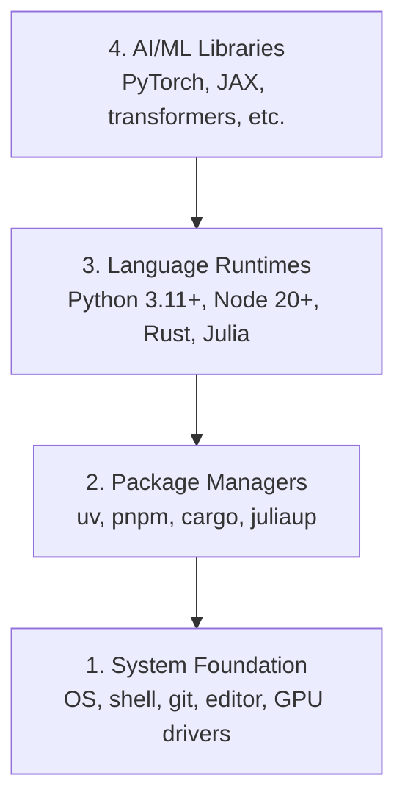

# Dev Environment

> Your tools shape your thinking. Set them up once, set them up right.

**Type:** Build
**Languages:** Python, Node.js, Rust
**Prerequisites:** None
**Time:** ~45 minutes

## Learning Objectives

- Set up Python 3.11+, Node.js 20+, and Rust toolchains from scratch
- Configure virtual environments and package managers for reproducible builds
- Verify GPU access with CUDA/MPS and run a test tensor operation
- Understand the four-layer stack: system, packages, runtimes, AI libraries

## The Problem

You're about to learn AI engineering across 500+ lessons using Python, TypeScript, Rust, and Julia. If your environment is broken, every single lesson becomes a fight against tooling instead of learning.

Most people skip environment setup. Then they spend hours debugging import errors, version conflicts, and missing CUDA drivers. We're going to do this once, properly.

## The Concept

An AI engineering environment has four layers:



We install bottom-up. Each layer depends on the one below it.

```figure
s0-env-stack
```

## Build It

### Step 1: System Foundation

Check your system and install the basics.

```bash
# macOS
xcode-select --install
brew install git curl wget

# Ubuntu/Debian
sudo apt update && sudo apt install -y build-essential git curl wget

# Windows (use WSL2)
wsl --install -d Ubuntu-24.04
```
wsl --install -d Ubuntu-24.04 this might give error as specific version mentioned is the issue simply put 
wsl --install -d Ubuntu

### Step 2: Python with uv

We use `uv` — it's 10-100x faster than pip and handles virtual environments automatically.

```bash
curl -LsSf https://astral.sh/uv/install.sh | sh      #if using windows remember to use bash instead of powershell

uv python install 3.12

uv venv
source .venv/bin/activate  # or .venv\Scripts\activate on Windows
#I used  source .venv/Scripts/activate  to activate the virtual environment in bash in windows 

uv pip install numpy matplotlib jupyter
```

Verify:

to verify as python was already installed using uv package manager simply type python in bash it will open python interpreter

```python
import sys
print(f"Python {sys.version}")

import numpy as np
print(f"NumPy {np.__version__}")
a = np.array([1, 2, 3])
print(f"Vector: {a}, dot product with itself: {np.dot(a, a)}")
```

### Step 3: Node.js with pnpm

For TypeScript lessons (agents, MCP servers, web apps).

```bash 
fnm stands for Fast Node Manager. It's a Node.js version manager written in Rust that lets you:

What it does:

Install and switch between multiple versions of Node.js
Manage Node.js versions per project or globally
Automatically use the right Node.js version for each project

```

```bash
You can't install fnm with uv because fnm is a Node.js version manager (not a Python package), while uv is for Python package

```

```bash
curl -fsSL https://fnm.vercel.app/install | bash
# for me above command curl didn't worked use in powershell winget install Schniz.fnm
# restart the terminal or open a new terminal cmd  whatever
fnm install 22
fnm use 22

npm install -g pnpm

node -e "console.log('Node', process.version)"
```

as I installed using winget install schniz.fnm 
```bash

Start with step 3 if this command does not work notepad $PROFILE then follow 
No problem — your PowerShell profile folder/file doesn't exist yet. Let's create it.

Run these one by one in PowerShell:

Step 1
 New-Item -ItemType Directory -Force -Path (Split-Path $PROFILE)


Then:
Step 2 
New-Item -ItemType File -Force -Path $PROFILE


Now open it:
Step 3
notepad $PROFILE


Paste this line into Notepad:
Step 4
fnm env --use-on-cd | Out-String | Invoke-Expression


Save and close Notepad.

Then close the PowerShell/VS Code terminal and open a new one.

Test:

Step 5
fnm --version


Then:

fnm install 22

// below command was not working  current PowerShell session still isn't loading the FNM environment.

Troubleshoot
Perfect 👍 FNM is working now.

That warning just means Node.js 22.23.2 is already installed, so you don't need to install it again.

Run:

fnm use 22


Then:

node -v


You should see:

v22.23.2


And check npm:

npm -v

If fnm use 22 works

You're all set. 🎉

For your AI Engineering From Scratch project, you can now run:

npm init -y


or, if you're starting a project with a framework, we can set that up next.

still if fnm use 22 doesn't work then

Got it — FNM itself is installed, but your current PowerShell session still isn't loading the FNM environment.

Let's fix it directly.

1. Check your profile path

Run:

echo $PROFILE


It should show something like:

C:\Users\deepa\Documents\WindowsPowerShell\Microsoft.PowerShell_profile.ps1

2. Add FNM to the profile automatically

Run this exact command:

"fnm env --use-on-cd | Out-String | Invoke-Expression" | Add-Content -Path $PROFILE

3. Load the profile immediately

Instead of restarting, run:

. $PROFILE


Then check:

fnm env


You should see several environment-variable commands.

4. Now use Node 22
fnm use 22


Then:

node -v


Expected:

v22.23.2

If you still get the same error

Run these two commands and send me the output:

echo $PROFILE


and

Get-Content $PROFILE


I'll tell you exactly what needs to be changed.
fnm use 22
node -v


You should get a Node version beginning with v22.


still use not working was getting 3 lines

Great — your profile is correct and FNM is configured. You just have the same line 3 times, which isn't necessary.

Let's clean it up and make sure it loads correctly.

1. Replace your profile with one FNM line

Run:

Set-Content $PROFILE 'fnm env --use-on-cd | Out-String | Invoke-Expression'


Now verify:

Get-Content $PROFILE


You should see only one line:

fnm env --use-on-cd | Out-String | Invoke-Expression

2. Reload the profile

Run:

. $PROFILE

3. Check FNM

Run:

fnm --version


You should get:

1.39.0

4. Use Node 22

Now run:

fnm use 22


Then:

node -v


You should get:

v22.23.2

If it STILL gives the environment-variable error

Run:

fnm env


and send me the output. Don't reinstall Node or FNM yet — your installation appears fine; we're just fixing the PowerShell environment.

then if this is the error shown in powershell


PS C:\Users\deepa\OneDrive\Desktop\AI Engineering From Scratch> . $PROFILE
. : File C:\Users\deepa\OneDrive\Documents\WindowsPowerShell\Microsoft.PowerShell_profile.ps1 cannot be loaded because
running scripts is disabled on this system. For more information, see about_Execution_Policies at
https:/go.microsoft.com/fwlink/?LinkID=135170.
At line:1 char:3
+ . $PROFILE
+   ~~~~~~~~
    + CategoryInfo          : SecurityError: (:) [], PSSecurityException
    + FullyQualifiedErrorId : UnauthorizedAccess

then

Aha — now we found the actual problem. 👍

FNM is installed correctly. Your PowerShell execution policy is blocking your profile script from running.

Let's fix that.

1. Allow your PowerShell profile to run

Run this in PowerShell:

Set-ExecutionPolicy -ExecutionPolicy RemoteSigned -Scope CurrentUser


If PowerShell asks:

Execution Policy Change
[Y] Yes  [A] Yes to All  [N] No ...


Type:

Y


and press Enter.

2. Load your profile

Now run:

. $PROFILE


There should be no error.

3. Use Node 22
fnm use 22


Then:

node -v


You should get:

v22.23.2


And:

npm -v

4. Verify everything

You can run:

fnm current
node -v
npm -v


If node -v shows v22.23.2, you're completely set. 🚀

Don't reinstall FNM or Node. The issue was simply PowerShell's script execution policy.


```


**macOS / Apple Silicon (M1/M2/M3/M4):** If the installer stops with `Error: Cannot install under Rosetta 2 in ARM default prefix (/opt/homebrew)`, your terminal is running under Rosetta 2 (`arch` prints `i386`) while Homebrew is a native arm64 build. Install fnm forcing arm64, wire it into your shell, then rerun the commands above from `fnm install 22`:

```bash
arch -arm64 brew install fnm
echo 'eval "$(fnm env --use-on-cd)"' >> ~/.zshrc
source ~/.zshrc
```

### Step 4: Rust

For performance-critical lessons (inference, systems).

```bash
curl --proto '=https' --tlsv1.2 -sSf https://sh.rustup.rs | sh

rustc --version
cargo --version
```

### Step 5: Julia (Optional)

For math-heavy lessons where Julia shines.

```bash
curl -fsSL https://install.julialang.org | sh  #for me used windows package manager winget install julia -s msstore

julia -e 'println("Julia ", VERSION)'
```

### Step 6: GPU Setup (If You Have One)

**NVIDIA (Linux / Windows):**

```bash
nvidia-smi

# Install PyTorch with CUDA
uv pip install torch torchvision torchaudio --index-url https://download.pytorch.org/whl/cu124
```

**macOS / Apple Silicon (M1/M2/M3/M4):** There is no CUDA on a Mac — that's expected, not a failure. Do **not** pass `--index-url .../cuXXX` (those wheels are Linux/Windows only, so the install fails). Install the plain build, which includes Apple's MPS (Metal) GPU backend:

```bash
uv pip install torch torchvision torchaudio
```

Verify (works on any platform):

```python
import torch
print(f"CUDA available: {torch.cuda.is_available()}")           # False on macOS — expected
print(f"MPS available:  {torch.backends.mps.is_available()}")   # True on Apple Silicon
if torch.cuda.is_available():
    print(f"GPU: {torch.cuda.get_device_name(0)}")
```

No GPU? No problem. Most lessons work on CPU. For training-heavy lessons, use Google Colab or cloud GPUs.

### Step 7: Verify the route you want to start

Run every command in this lesson from the repository root, the directory that
contains `README.md` and `phases/`. The preflight checks only what you need to
start the selected route. It skips later tools by default so a new learner sees
one clear answer instead of a wall of warnings.

Start the full beginner sequence:

```bash
python3 phases/00-setup-and-tooling/01-dev-environment/code/verify.py --route beginner
```

Or check only the route you want:

```bash
python3 phases/00-setup-and-tooling/01-dev-environment/code/verify.py --route ml-foundations
python3 phases/00-setup-and-tooling/01-dev-environment/code/verify.py --route llm-engineering
python3 phases/00-setup-and-tooling/01-dev-environment/code/verify.py --route agents
python3 phases/00-setup-and-tooling/01-dev-environment/code/verify.py --route mcp
python3 phases/00-setup-and-tooling/01-dev-environment/code/verify.py --route agent-skills
python3 phases/00-setup-and-tooling/01-dev-environment/code/verify.py --route certification
```

Add `--show-later` when you want the same preflight to inspect optional tools
and dependencies used by later lessons. A missing later tool never blocks the
selected route.

Each failed required check includes the detected path or import error and an
exact corrective command. The Agent Skills and certification routes also show
manual host checks because a Python script cannot prove that an AI host has
discovered a skill or that your chosen skill scope is writable.

When the beginner preflight passes, it prints the exact first runnable lesson:

```text
Ready to start Beginner course.
Next: python3 phases/01-math-foundations/01-linear-algebra-intuition/code/vectors.py
```

## Use It

Your environment is ready to start the route you checked. Install later tools
when a lesson asks for them instead of blocking your first lesson on the whole
stack. Here is what you will use across the curriculum:

| Language | Used In | Package Manager |
|----------|---------|-----------------|
| Python | Phases 1-12 (ML, DL, NLP, Vision, Audio, LLMs) | uv |
| TypeScript | Phases 13-17 (Tools, Agents, Swarms, Infra) | pnpm |
| Rust | Phases 12, 15-17 (Performance-critical systems) | cargo |
| Julia | Phase 1 (Math foundations) | Pkg |

## Ship It

This lesson produces a verification script that anyone can run to check their setup.

See `outputs/prompt-env-check.md` for a prompt that helps AI assistants diagnose environment issues.

## Exercises

1. Run the verification script and fix any failures
2. Create a Python virtual environment for this course and install PyTorch
3. Write a "hello world" in all four languages and run each one
